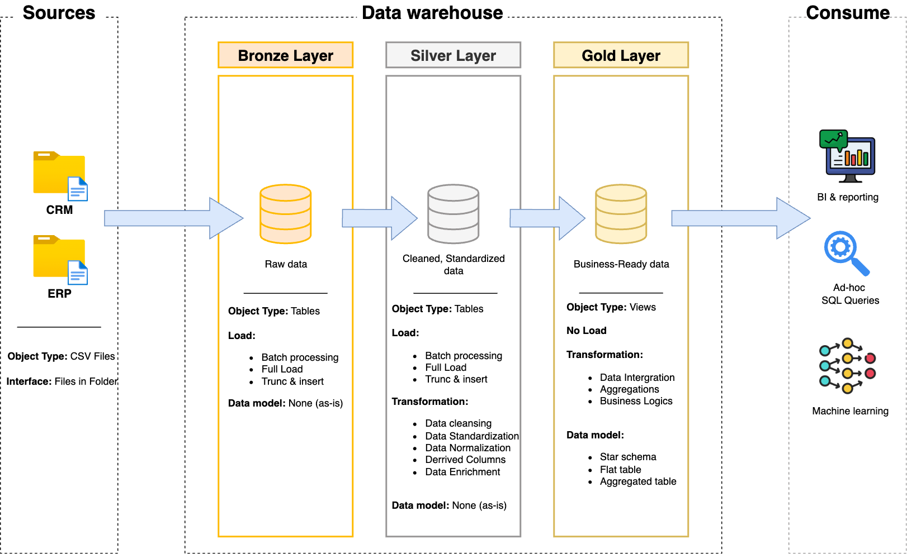

# Data Warehouse and Analytics Project
Welcome to **Data Warehouse and Analytics Project** repo!

This project demonstrates a comprehensive data warehousing and analytics solution, from building a dataware housse to generating actionable insights. Designed as a portfolio project highlights industry best practices in data engineering and analytics.

---

## 🏗 Data Architecture
The data architecture for this project follows Medallion Architecture **Bronze**, **Silver**, and **Gold** layers:




1. **Bronze Layer**: Stores raw data as-is from the source systems. Data is ingested from CSV Files into PostgreSQL Database.   

2. **Silver Layer**: This layer includes data cleansing, standardization, and normalization processes to prepare data for analysis.

3. **Gold Layer**: Houses business-ready data modeled into a star schema required for reporting and analytics.

---

## 📖 Project Overview

This project including:
1. **Data Architecture**: Designing a Modern Data Warehouse Using Medallion Architecture **Bronze**, **Silver**, and **Gold** layers.
2. **ETL Pipelines**: Extracting, transforming, and loading data from source systems into the warehouse.
3. **Data Modeling**: Developing fact and dimension tables optimized for analytical queries.

---
## 🛠 Links & Tools:
- **[Datasets](datasets):** Access to the project dataset (csv files).
- **[PostgreSQL](https://www.microsoft.com/en-us/sql-server/sql-server-downloads):** Lightweight server for hosting your PostgreSQL database.
- **[Git Repository](https://github.com/):** Set up a GitHub account and repository to manage, version, and collaborate on your code efficiently.
- **[DrawIO](https://www.drawio.com/):** Design data architecture, models, flows, and diagrams.

---
## ☑️ Project Requirements

### Building the Data Warehouse

#### Objective
Develop a modern data warehouse using PostgreSQL to consolidate sales data, enabling analytical reporting and informed decision-making.

#### Specifications
- **Data Sources**: Import data from two source systems (ERP and CRM) provided as CSV files.
- **Data Quality**: Cleanse and resolve data quality issues prior to analysis.
- **Integration**: Combine both sources into a single, user-friendly data model designed for analytical queries.
- **Scope**: Focus on the latest dataset only; historization of data is not required.
- **Documentation**: Provide clear documentation of the data model to support both business stakeholders and analytics teams.

---
## 📂 Repository Structure
```
└── postgreSQL-data-warehouse-project/
    ├── datasets/              # Raw datasets used for the project (ERP and CRM data)
    │   ├── source_crm/
    │   └── source_erp/
    ├── docs/                  # Project documentation and architecture details
    │   └── img/
    │       ├── Data-Architecture.png
    │       ├── Data-flow.png
    │       └── Data-Layers.png
    ├── scripts/               # SQL scripts for ETL and transformations
    │   ├── bronze/            # Scripts for extracting and loading raw data
    │   ├── silver/            # Scripts for cleaning and transforming data
    │   └── gold/              # Scripts for creating analytical models
    ├── tests/                 # Test scripts and quality files
    └── README.md              # Project overview and instructions
```
---
